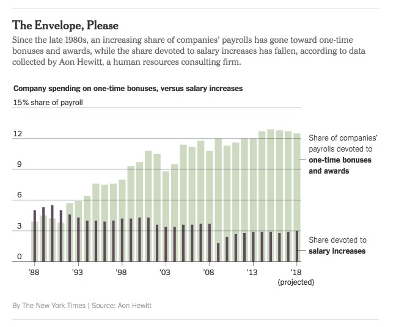

“Pressure to increase productivity and minimize costs,” the report concluded, had pushed employers to forgo raises and rely more on short-term awards “as the primary means of rewarding for performance.”

> https://www.nytimes.com/2018/02/10/business/economy/bonus-pay.html
